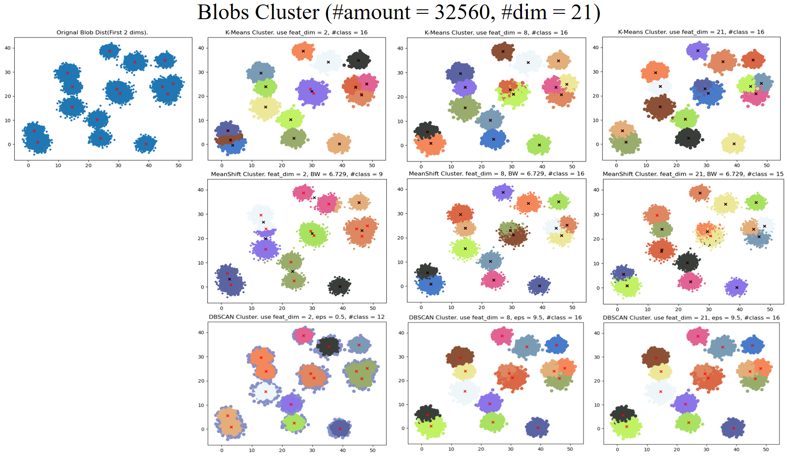
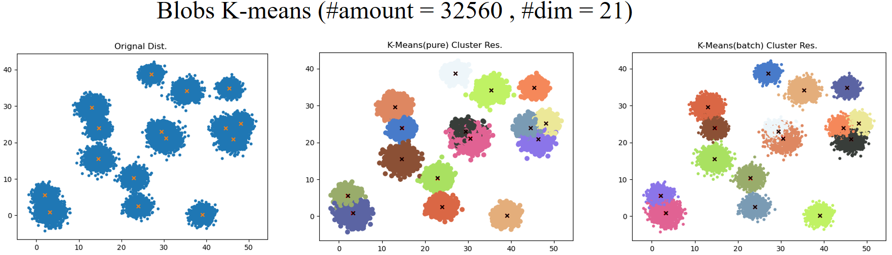
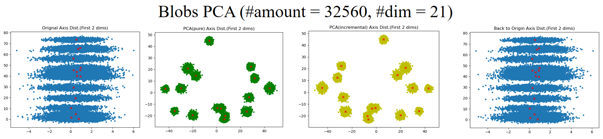
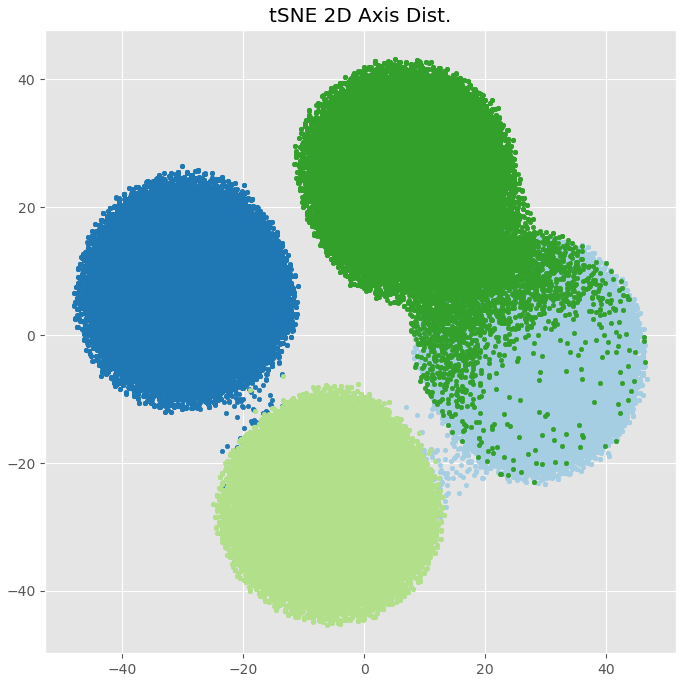

# Processing Methods Assemble
Summary of most frequently used data processing methods (Non-DNN method). Most of them are related to unsupervised learning and representation learning. 

## cluster methods
> in `sklearn.cluster`

Using `datasets. make_blobs` The high-order data generated by blobs, using the clustering results of the above three clustering methods

| Method Name | Hyper-Para | Description |
|----| ---| --- |
| K-Means | #classes   | Specify the number of categories in advance as Hyper-Para. Batch-wise version: *minibatch* |
| Mean-Shift | band width | Smaller BW get more #classes | 
| DBSCAN | eps, | For nonlinear clustering, each class cannot give the central coordinates |

## dimensionality reduction methods

>in `sklearn.decomposition`(PCA), `sklearn.discriminant_analysis`(LDA), `sklearn.manifold`(t-SNE, LLE)

| Method Name | Hyper-Para | Description |
|----| ---| --- |
| PCA |  #components   | The covariance matrix is optimized so that the diagonal elements are in descending order and other positions are 0. Batch-wise version: *incremental* | 
| LDA |   Class Label. | Maximize the distance between classes and minimize the distance within classes. | 
| LLE |---| --- |
| t-SNE | #components | On the premise of keeping the high-dimensional distance unchanged, the data points are remapped to 2 or 3 dimensions for visualization. It is not a clustering algorithm, but a means to analyze the effectiveness of clustering. Original space (n-D): Gaussian dist. ; Embedded space (2-D): t dist. | 

